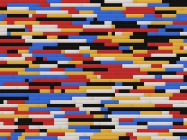
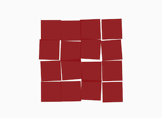
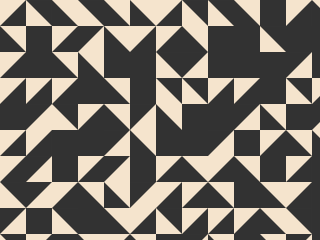
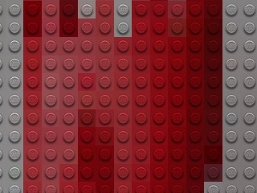
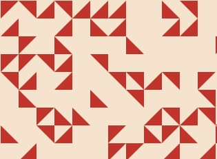
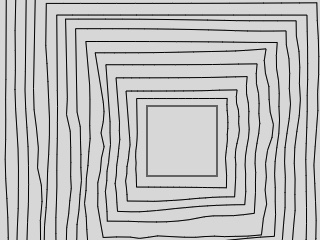

# Generative-Art-Praxis
This page includes Generative Art #P5JS sketches and aims to research for myself and inspiration for students and curious ones. Several notable artists inspire the content from history. You can find reproductions of relevant artists' works for computational mediums. Included recreation of styles belongs not only to programmer-artists but also to traditional artists like Sol LeWitt.

**Please submit a request in this repository if you want me to work on a specific artist and style.**

## [Generative Art Praxis](https://github.com/alptugan/Generative-Art-Praxis)

## This repository includes following studies;

[Sol LeWitt's "Wall Drawing" Series](https://github.com/alptugan/Generative-Art-Praxis/tree/main/01_Sol_Lewitt_Wall_drawing_generator_01) | [Hiroshi Kawano's "Mondrian" Series](https://github.com/alptugan/Generative-Art-Praxis/tree/main/03_Hiroshi-Kawano) | [Vera Molnar's "16 Carres" 1986](https://github.com/alptugan/Generative-Art-Praxis/tree/main/04_Vera_Molnar-16_Carres_1986)
------------- | ------------- | -------------
  |  | 

[Anni Albers' "Intaglio II" 1976](https://github.com/alptugan/Generative-Art-Praxis/tree/main/05_Annie_Albers-Intaglio_II-1976) | [Lego Mosaic Generator](https://github.com/alptugan/Generative-Art-Praxis/tree/main/06_ImageProcessing_Lego_Brick) | [Anni Albers "Intaglio IV" 1976](https://github.com/alptugan/Generative-Art-Praxis/tree/main/07_Annie_Albers-Intaglio_IV-1976)
------------- | ------------- | -------------
  |  | 

[Vera Molnar's "Hypertransformations" 1976](https://github.com/alptugan/Generative-Art-Praxis/tree/main/08_Vera-Molnar_Hypertransformations-1976) | [Upcoming](#) | [Upcoming](#)
------------- | ------------- | -------------
  |  | 

## Required Libraries
[DAT GUI JS (Included already)](https://github.com/dataarts/dat.gui)

[P5.JS-Export (Included already)](https://github.com/drskullster/p5.js-export)

[P5JS.Utils (Included already - WIP)](https://github.com/alptugan/p5.utils)
